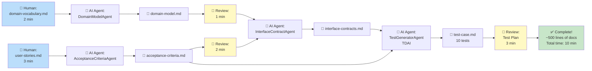
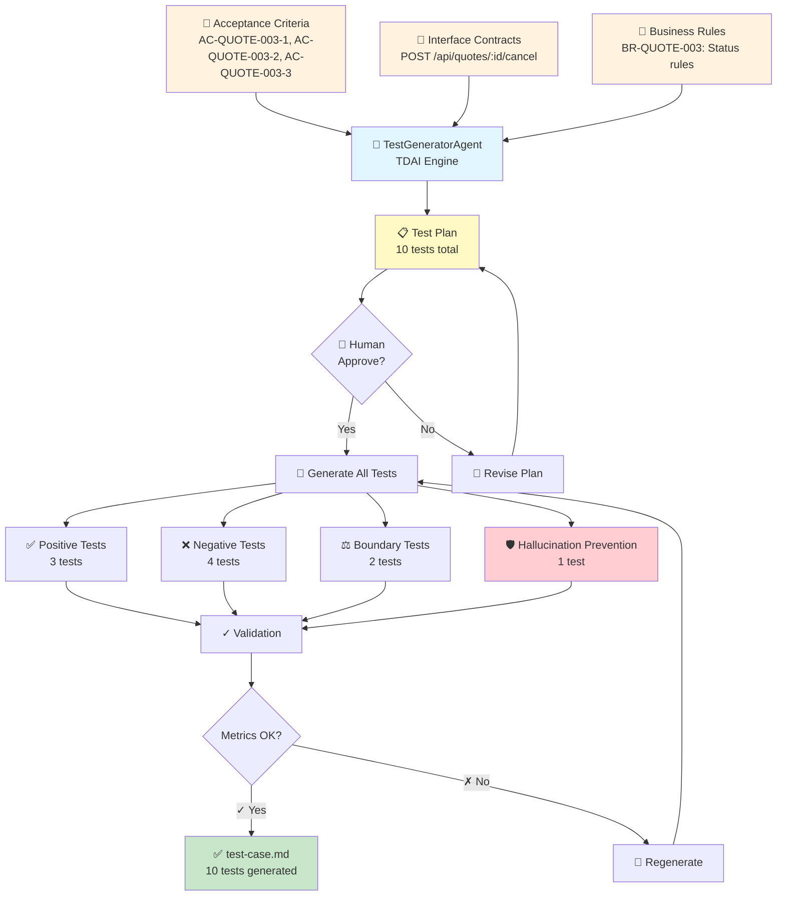
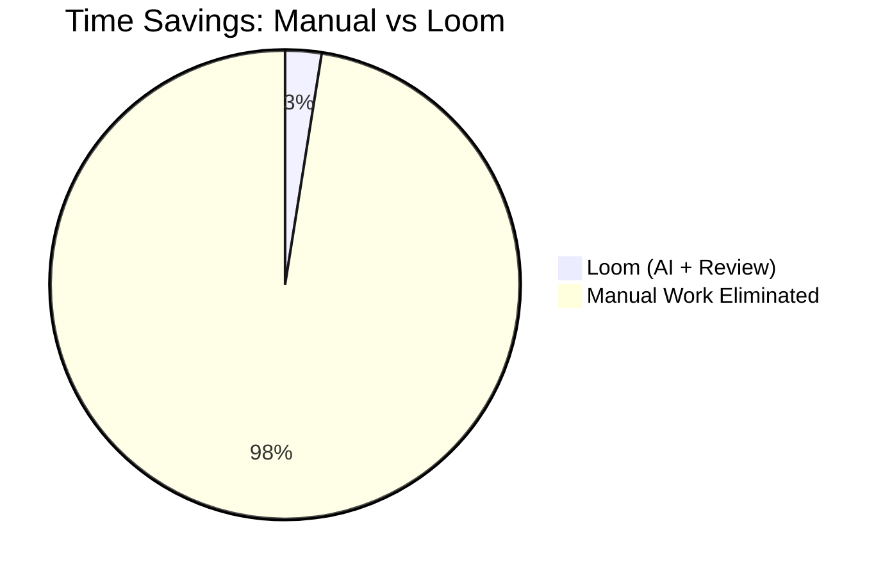
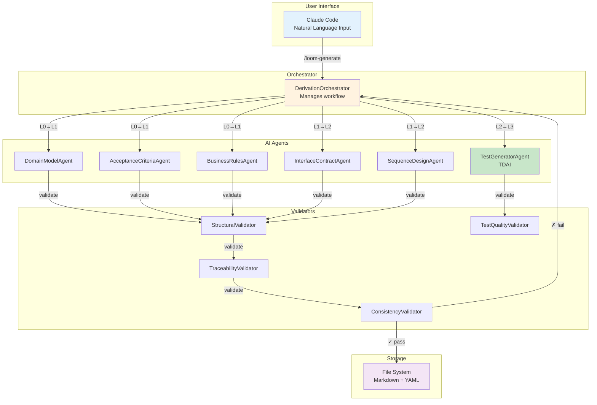
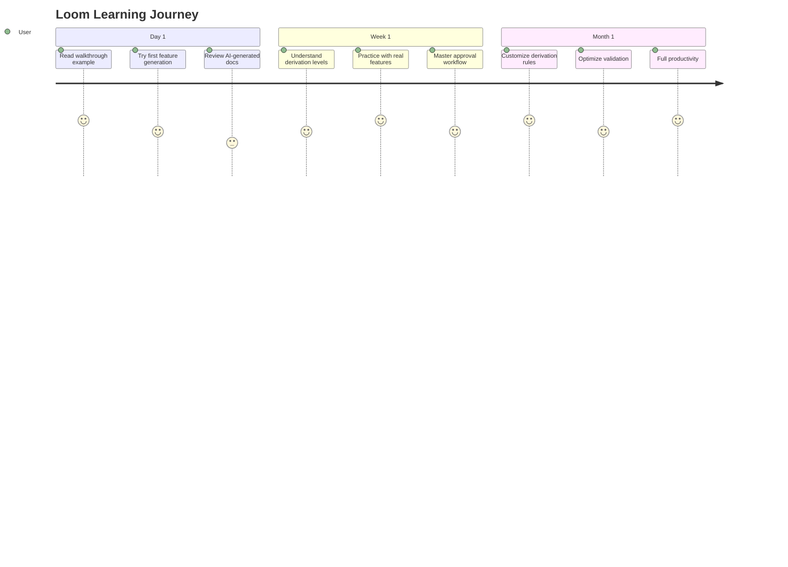
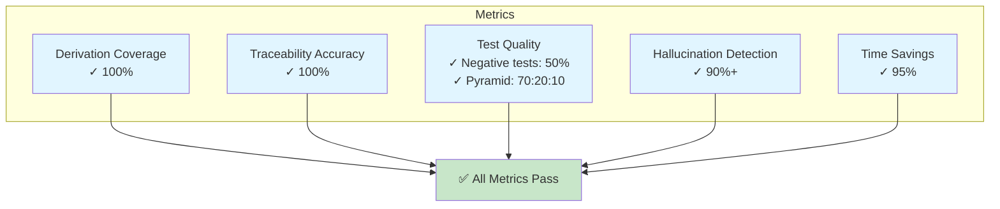

# Documentation Derivation - Visual Diagrams

## 📊 Complete Derivation Flow

```mermaid
graph TB
    subgraph L0["LEVEL 0: FOUNDATIONAL (Human Input)"]
        DV[domain-vocabulary.md<br/>👤 Human: 2 min]
        US[user-stories.md<br/>👤 Human: 3 min]
        NFR[non-functional-requirements.md<br/>👤 Human: optional]
        PH[project-handbook/*<br/>👤 Human: one-time setup]
    end

    subgraph L1["LEVEL 1: PRIMARY DERIVATION (AI 80%)"]
        DM[domain-model.md<br/>🤖 AI → 👤 Review: 1 min]
        AC[acceptance-criteria.md<br/>🤖 AI → 👤 Review: 2 min]
        BR[business-rules.md<br/>🤖 AI → ✓ Auto-approved]
        BC[bounded-context-map.md<br/>🤖 AI → ✓ Auto-approved]
    end

    subgraph L2["LEVEL 2: SECONDARY DERIVATION (AI 90%)"]
        IC[interface-contracts.md<br/>🤖 AI → 👤 Review: optional]
        SD[sequence-design.md<br/>🤖 AI → ✓ Auto-approved]
        IDM[initial-data-model.md<br/>🤖 AI → ✓ Auto-approved]
        AD[aggregate-design.md<br/>🤖 AI → ✓ Auto-approved]
        TS[tech-specs.md<br/>🤖 AI → ✓ Auto-approved]
    end

    subgraph L3["LEVEL 3: TERTIARY DERIVATION (AI 95%)"]
        TC[test-cases.md<br/>🤖 AI → 👤 Test Plan: 3 min]
        API[openapi.json<br/>🤖 AI → ✓ Auto-approved]
        SKEL[implementation-skeletons.md<br/>🤖 AI → ✓ Auto-approved]
        FT[feature-tickets.md<br/>🤖 AI → ✓ Auto-approved]
        SB[service-boundaries.md<br/>🤖 AI → ✓ Auto-approved]
        EM[event-message-design.md<br/>🤖 AI → ✓ Auto-approved]
        DEP[dependency-graph.md<br/>🤖 AI → ✓ Auto-approved]
    end

    %% L0 → L1 Derivations
    DV -->|DomainModelAgent| DM
    DV -->|BusinessRulesAgent| BR
    US -->|AcceptanceCriteriaAgent| AC
    US -->|BusinessRulesAgent| BR
    DV -->|BoundedContextAgent| BC

    %% L1 → L2 Derivations
    DM -->|InterfaceContractAgent| IC
    AC -->|InterfaceContractAgent| IC
    BR -->|InterfaceContractAgent| IC
    DM -->|SequenceDesignAgent| SD
    US -->|SequenceDesignAgent| SD
    BR -->|SequenceDesignAgent| SD
    DM -->|DataModelAgent| IDM
    DM -->|AggregateDesignAgent| AD
    IC -->|AggregateDesignAgent| AD

    %% L2 → L3 Derivations
    AC -->|TestGeneratorAgent<br/>TDAI| TC
    IC -->|TestGeneratorAgent<br/>TDAI| TC
    BR -->|TestGeneratorAgent<br/>TDAI| TC
    US -->|FeatureTicketAgent| FT
    AC -->|FeatureTicketAgent| FT
    DM -->|ServiceBoundaryAgent| SB
    IC -->|ServiceBoundaryAgent| SB
    IC -->|EventMessageAgent| EM
    SD -->|EventMessageAgent| EM

    style L0 fill:#e1f5ff,stroke:#01579b,stroke-width:2px
    style L1 fill:#fff3e0,stroke:#e65100,stroke-width:2px
    style L2 fill:#f3e5f5,stroke:#4a148c,stroke-width:2px
    style L3 fill:#e8f5e9,stroke:#1b5e20,stroke-width:2px

    style DV fill:#bbdefb
    style US fill:#bbdefb
    style TC fill:#c8e6c9
```



---

## 🔄 Derivation Pipeline (Linear View)



---

## 🎯 Human Touch Points

```mermaid
gantt
    title Human Effort Distribution (10 min total)
    dateFormat  mm
    axisFormat  %M min

    section Human Input
    Write vocabulary           :a1, 00, 2m
    Write user stories         :a2, 02, 3m

    section AI Derivation
    AI generates L1 docs       :crit, a3, 05, 1m

    section Human Review
    Review acceptance criteria :a4, 06, 2m

    section AI Derivation
    AI generates L2 & L3       :crit, a5, 08, 1m

    section Human Review
    Review test plan           :a6, 09, 1m

    section Complete
    Validation                 :milestone, m1, 10, 0m
```



---

## 🧪 TDAI Test Generation Flow



---

## 🔗 Traceability Graph Example

```mermaid
graph LR
    subgraph Documentation
        DV["domain-vocabulary.md<br/>#quote-cancellation"]
        US["user-stories.md<br/>#us-quote-003"]
        AC1["acceptance-criteria.md<br/>#ac-quote-003-1"]
        AC2["acceptance-criteria.md<br/>#ac-quote-003-2"]
        BR["business-rules.md<br/>#br-quote-003"]
        API["interface-contracts.md<br/>#api-post-quote-cancel"]
    end

    subgraph Code
        QE["src/domain/Quote.ts<br/>ENT-Quote entity"]
        CM["src/domain/Quote.ts<br/>cancel method"]
    end

    subgraph Tests
        TC1["test-case.md<br/>#tc-quote-003-001"]
        TC2["test-case.md<br/>#tc-quote-003-002"]
        TC9["test-case.md<br/>#tc-quote-003-009"]
    end

    DV -->|defines| US
    US -->|derives| AC1
    US -->|derives| AC2
    AC2 -->|derives| BR
    AC1 -->|derives| API
    BR -->|constrains| API

    US -.->|@traceability| QE
    AC2 -.->|@implements| BR
    BR -.->|@implements| CM
    API -.->|implements| CM

    AC1 -->|generates| TC1
    AC2 -->|generates| TC2
    AC1 -->|hallucination check| TC9

    TC1 -.->|tests| CM
    TC2 -.->|tests| CM
    TC9 -.->|tests| CM

    style DV fill:#bbdefb
    style US fill:#bbdefb
    style QE fill:#c8e6c9
    style CM fill:#c8e6c9
    style TC1 fill:#fff9c4
    style TC2 fill:#fff9c4
    style TC9 fill:#ffcdd2
```

---

## 📊 Time Savings Breakdown



**Manual:** 400 minutes (6.7 hours)
**With Loom:** 10 minutes
**Savings:** 390 minutes (95%)

---

## 🏗️ Architecture: AI Agents



---

## 🎓 Learning Curve



---

## 📈 Quality Metrics Dashboard



---

*These visual diagrams illustrate the Documentation Derivation System in Loom (AI-PDS). Use them for presentations, documentation, and training materials.*

*Render these diagrams in any Mermaid-compatible viewer (GitHub, Mermaid Live Editor, VS Code, etc.)*
