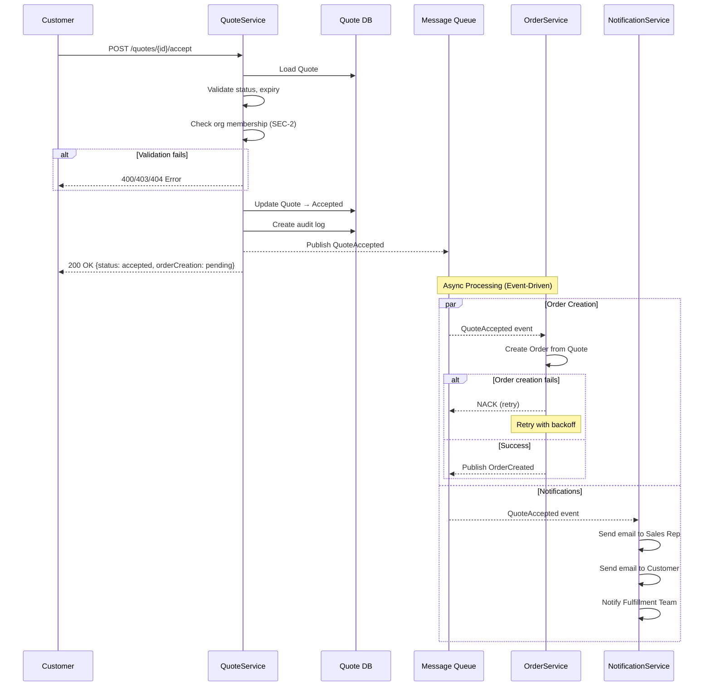
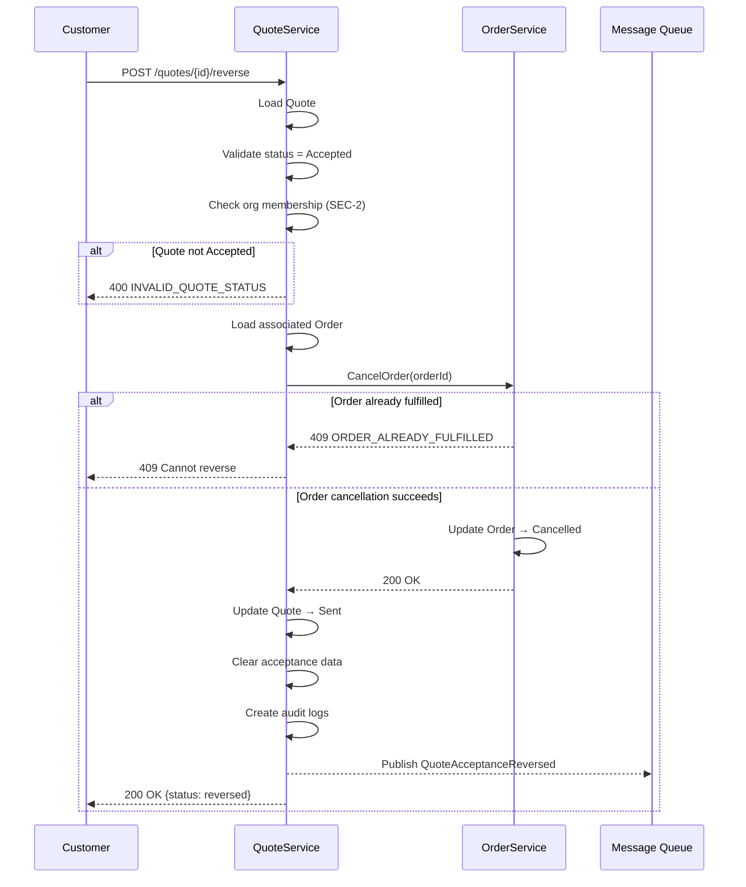
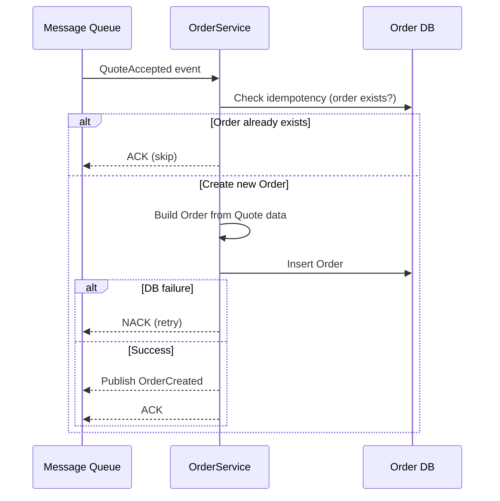
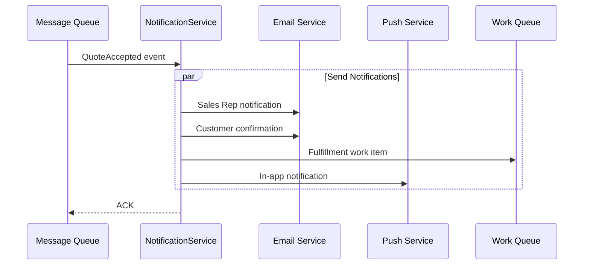

# Sequence Design – Quote Acceptance Flow

## Overview

This document describes the interaction sequences for the Quote Acceptance feature.

**Key Architectural Decisions (from Structured Interview):**

| Flow | Pattern | Rationale (from Interview) |
|------|---------|---------------------------|
| Quote → Order | Event-Driven Choreography | Don't block acceptance on Order service (1b) |
| Quote → Notifications | Event-Driven | Non-blocking, async (3b) |
| Failure Handling | Partial Success | Quote accepted even if Order fails (2b) |
| Reverse → Cancel Order | Synchronous | Immediate consistency required (4a) |

---

## 1. Quote Acceptance → Order Creation (Event-Driven)

**Trigger:** Customer accepts a Quote in the Customer Portal

**Pattern:** Event-Driven Choreography

**Decision Points Resolved:**
- API-1: Sync for Quote update, Async for Order creation (User: 1b)
- COM-1: Event-driven - QuoteService publishes, others subscribe (User: 1b)
- COM-3: Partial success - Order failure doesn't fail Quote acceptance (User: 2b)

**Sequence:**
1. Customer sends `AcceptQuote(quoteId)` to **QuoteService**
2. QuoteService validates:
   - Quote exists
   - Quote.status === "Sent"
   - Quote not expired
   - User belongs to Customer's organization
3. QuoteService updates Quote → `Accepted`
4. QuoteService creates audit log entry
5. QuoteService publishes **`QuoteAccepted`** event to Message Queue
6. QuoteService returns success response to Customer (with orderCreation: "pending")
7. OrderService receives `QuoteAccepted` event
8. OrderService creates Order from Quote data
9. OrderService publishes **`OrderCreated`** event
10. NotificationService receives `QuoteAccepted` event
11. NotificationService sends notifications to Sales Rep, Customer, Fulfillment Team

**Outcome:**
- Quote is in `Accepted` status
- Customer has immediate confirmation
- Order created asynchronously (typically within 5 seconds)
- All stakeholders notified

**Failure Handling (from COM-3 answer: Partial Success):**
- If OrderService fails to create Order:
  - Quote remains `Accepted`
  - Event is retried with exponential backoff
  - After 3 failed attempts: moved to Dead Letter Queue
  - Operations team alerted via monitoring
- If NotificationService fails:
  - Retry in background
  - Non-critical: Quote and Order processing continues



---

## 2. Quote Acceptance Reversal → Order Cancellation (Synchronous)

**Trigger:** Customer reverses a previously accepted Quote

**Pattern:** Synchronous Request-Response

**Decision Points Resolved:**
- API-1: Synchronous - immediate Order cancellation (User: 4a)
- COM-1: Direct sync call to OrderService (implied by sync choice)
- COM-3: All-or-nothing - if Order can't be cancelled, reversal fails

**Sequence:**
1. Customer sends `ReverseAcceptance(quoteId)` to **QuoteService**
2. QuoteService validates:
   - Quote exists
   - Quote.status === "Accepted"
   - User belongs to Customer's organization
3. QuoteService loads associated Order
4. QuoteService calls **OrderService.CancelOrder(orderId)** synchronously
5. OrderService validates:
   - Order.status NOT IN ("Fulfilled", "Shipped", "PartiallyShipped")
6. OrderService updates Order → `Cancelled`
7. OrderService returns success to QuoteService
8. QuoteService updates Quote → `Sent`
9. QuoteService clears acceptance data (acceptedAt, acceptedBy)
10. QuoteService creates audit log entries
11. QuoteService publishes **`QuoteAcceptanceReversed`** event
12. QuoteService returns success response to Customer

**Outcome:**
- Quote is back to `Sent` status (can be accepted again)
- Order is `Cancelled`
- Audit trail records the reversal

**Failure Handling:**
- If Order is already fulfilled/shipped:
  - Return 409 Conflict
  - Quote remains `Accepted`
  - No state changes
- If OrderService is unavailable:
  - Return 503 Service Unavailable
  - Customer can retry

**Why Synchronous (from Interview 4a):**
- Customer expects immediate confirmation of reversal
- Order cancellation must be confirmed before Quote status changes
- Avoids inconsistent state (Quote reversed but Order still active)



---

## 3. Order Creation from QuoteAccepted Event

**Trigger:** OrderService receives `QuoteAccepted` event

**Pattern:** Event Consumer with Idempotency

**Sequence:**
1. OrderService receives `QuoteAccepted` event from Message Queue
2. OrderService checks idempotency (Order for this Quote already exists?)
3. If Order exists: ACK event, skip processing
4. OrderService creates Order:
   - Generate Order ID
   - Copy line items from Quote
   - Set status = `Pending`
   - Link to Quote
5. OrderService persists Order
6. OrderService publishes **`OrderCreated`** event
7. OrderService ACKs the `QuoteAccepted` event

**Idempotency:**
- Check: `SELECT * FROM orders WHERE quote_id = :quoteId`
- If exists: Skip creation, ACK event

**Error Handling:**
- Transient failure (DB timeout): NACK, retry
- Business failure (invalid data): Log error, move to DLQ
- After 3 retries: Dead Letter Queue + alert



---

## 4. Notification Flow

**Trigger:** NotificationService receives `QuoteAccepted` event

**Pattern:** Fire-and-Forget (Non-Critical)

**Decision Points Resolved:**
- COM-1: Event-driven, async (User: 3b)
- Non-blocking: Notification failure doesn't affect Quote/Order

**Notifications Sent:**

| Recipient | Channel | Content |
|-----------|---------|---------|
| Sales Rep | Email + In-App | "Quote {quoteNumber} accepted by {customerName}" |
| Customer | Email | Confirmation with Order details |
| Fulfillment | Work Queue | New Order notification with priority |

**Error Handling:**
- Email send failure: Retry 3 times, then log and continue
- Non-critical: Quote and Order processing not affected



---

## Sequence Summary

| # | Flow | Pattern | Sync/Async | Critical? |
|---|------|---------|------------|-----------|
| 1 | Accept Quote | Request-Response | Sync | Yes |
| 1a | Create Order | Event-Driven | Async | Yes (retry) |
| 1b | Send Notifications | Event-Driven | Async | No |
| 2 | Reverse Acceptance | Request-Response | Sync | Yes |
| 2a | Cancel Order | Direct Call | Sync | Yes |

---

## Structured Interview Impact

### Without Structured Interview (Implicit Decisions)

```
AcceptQuote:
  1. Update Quote → Accepted
  2. Call OrderService.CreateOrder() SYNC  ← Could cause timeout!
  3. Call NotificationService.Send() SYNC  ← Could cause timeout!
  4. Return response

Problems:
- If OrderService slow: Customer waits, timeout risk
- If OrderService down: Quote acceptance fails
- Tight coupling between services
```

### With Structured Interview (Explicit Decisions)

```
AcceptQuote:
  1. Update Quote → Accepted
  2. Publish QuoteAccepted event
  3. Return response immediately

OrderService (async):
  - Subscribes to QuoteAccepted
  - Creates Order with retry logic

NotificationService (async):
  - Subscribes to QuoteAccepted
  - Sends notifications, non-blocking

Benefits:
- Customer gets immediate response
- Services decoupled
- Partial success possible
- Resilient to downstream failures
```

**The difference:** Event-driven architecture chosen explicitly based on user's answer that "Quote acceptance shouldn't fail if Order service is slow."
