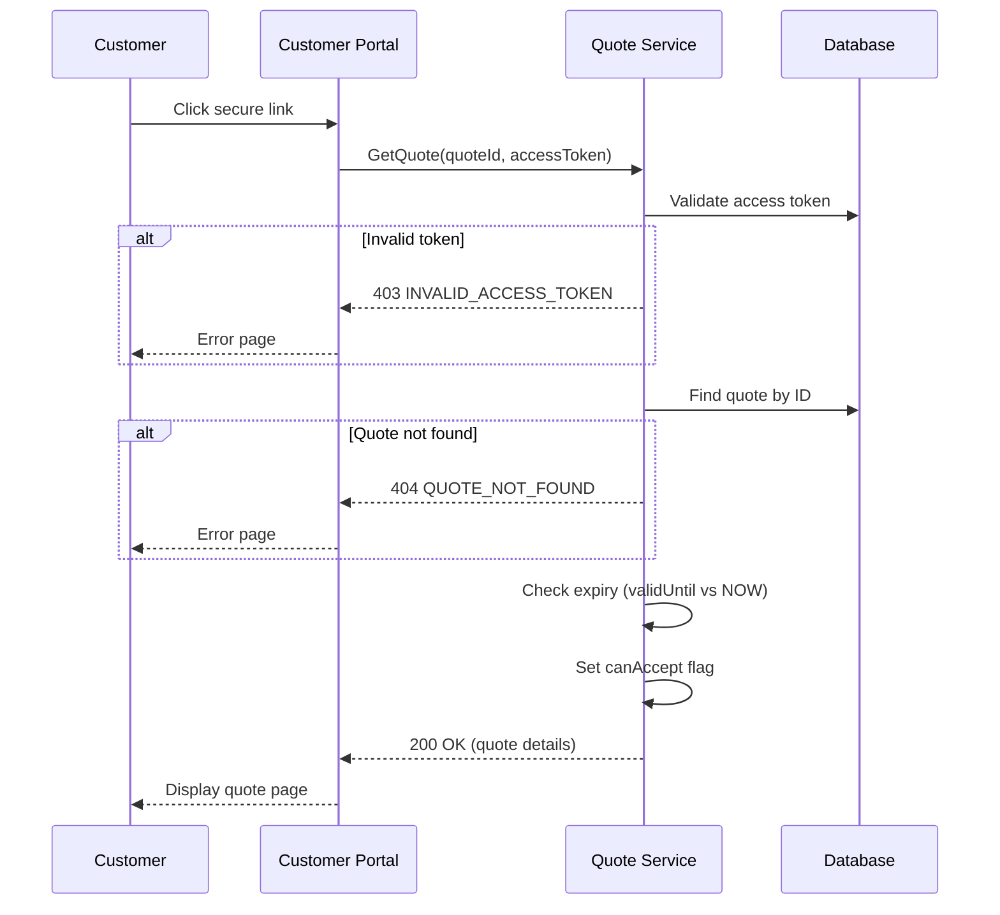
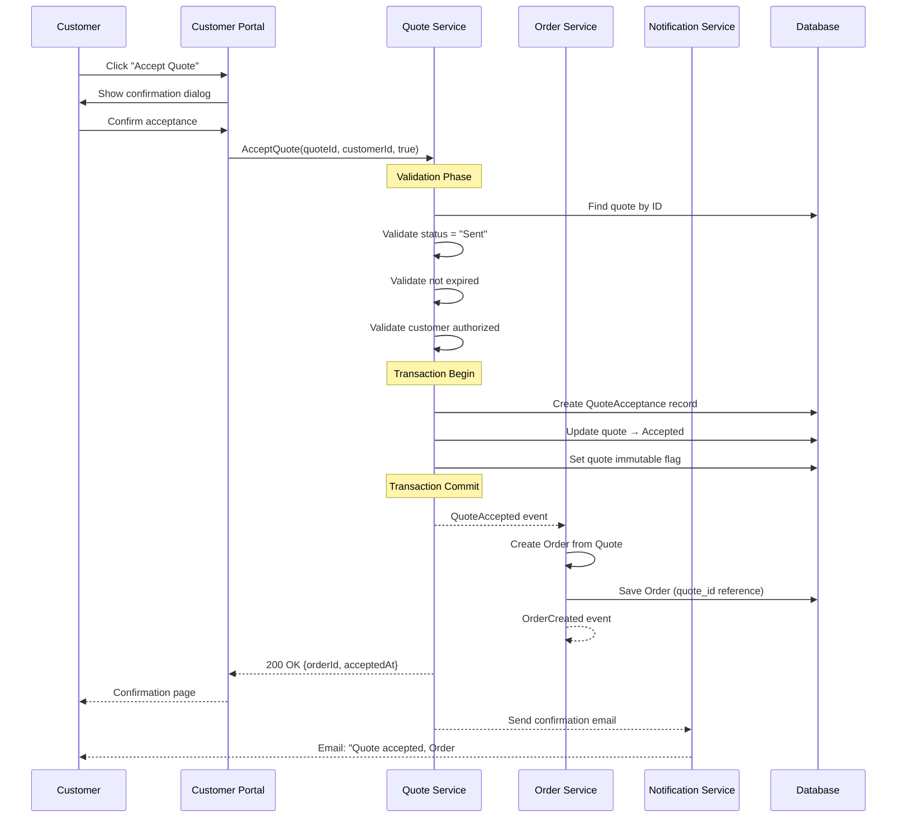
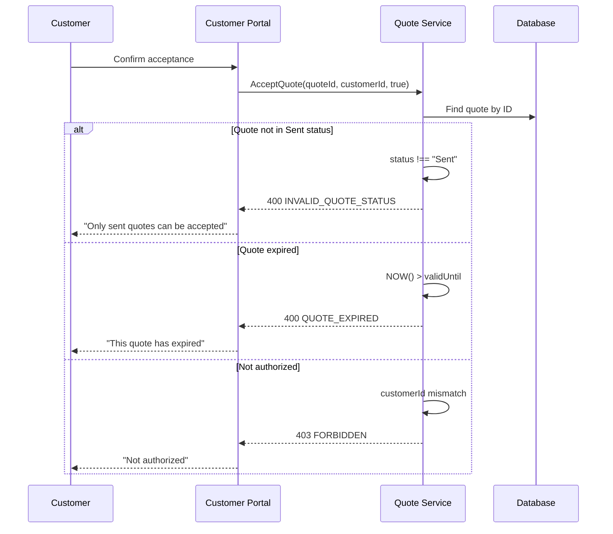
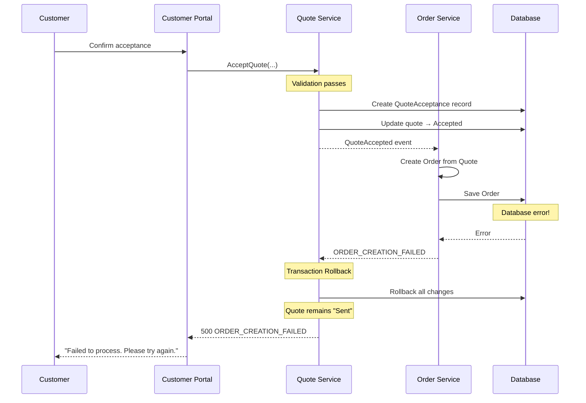
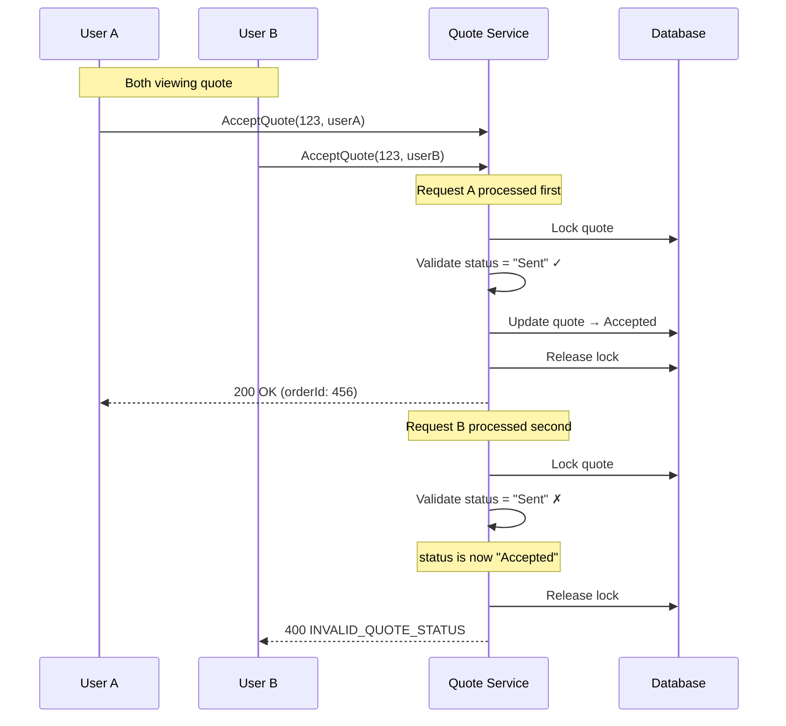

# Sequence Design – Quote Acceptance

This document provides textual and Mermaid-based sequence specifications
for the Quote Acceptance → Order Creation workflow.

---

## 1. View Quote via Secure Link

**Trigger:** Customer clicks secure link in quote notification email.

**Traceability:** AC-QUOTE-003-1

**Sequence:**
1. Customer clicks secure link containing `quoteId` and `accessToken`.
2. Customer Portal sends `GetQuote(quoteId, accessToken)` to **Quote Service**.
3. Quote Service validates:
   - Access token is valid and not expired
   - Quote exists
   - Quote belongs to customer
4. Quote Service checks quote expiry status.
5. Quote Service returns quote details with `canAccept` flag.
6. Customer Portal displays quote details page.

**Outcome:**
Customer can view quote details and decide whether to accept.

**Error Paths:**
- Invalid token → 403 INVALID_ACCESS_TOKEN → Error page
- Quote not found → 404 QUOTE_NOT_FOUND → Error page
- Quote expired → 410 QUOTE_EXPIRED → Show expired notice

---

## 2. Quote Acceptance → Order Creation (Happy Path)

**Trigger:** Customer clicks "Accept Quote" button and confirms.

**Traceability:** AC-QUOTE-003-2, AC-QUOTE-003-3, AC-QUOTE-003-4, AC-QUOTE-003-5, AC-QUOTE-003-6

**Sequence:**
1. Customer clicks "Accept Quote" button.
2. Customer Portal displays confirmation dialog.
3. Customer confirms acceptance.
4. Customer Portal sends `AcceptQuote(quoteId, customerId, true)` to **Quote Service**.
5. Quote Service validates:
   - Quote exists
   - Quote status is `Sent` (BR-QUOTE-001)
   - Quote not expired (BR-QUOTE-006)
   - Customer is authorized
6. Quote Service begins transaction:
   a. Create QuoteAcceptance audit record (BR-QUOTE-003)
   b. Update Quote status → `Accepted`
   c. Mark Quote as immutable (BR-QUOTE-002)
7. Quote Service emits domain event: **`QuoteAccepted`**.
8. Order Service receives `QuoteAccepted` event.
9. Order Service creates Order from Quote:
   - Copy line items
   - Set `quote_id` reference (BR-QUOTE-005)
   - Set status to `Pending`
10. Order Service emits domain event: **`OrderCreated`**.
11. Quote Service returns success with `orderId`.
12. Customer Portal displays confirmation page.
13. Notification Service sends confirmation email.

**Outcome:**
Quote is accepted, Order is created, customer has order reference and confirmation.

---

## 3. Quote Acceptance – Validation Failures

**Trigger:** Customer attempts to accept a quote that fails validation.

**Traceability:** AC-QUOTE-003-2 (error cases), BR-QUOTE-001, BR-QUOTE-006

**Sequence:**
1. Customer confirms acceptance.
2. Customer Portal sends `AcceptQuote(...)` to **Quote Service**.
3. Quote Service validates and finds issue:
   - Quote not in `Sent` status, OR
   - Quote has expired
4. Quote Service returns appropriate error.
5. Customer Portal displays error message.

**Outcome:**
Acceptance is rejected, quote remains unchanged.

**Error Scenarios:**

| Scenario | Error Code | User Message |
|----------|------------|--------------|
| Quote is Draft | INVALID_QUOTE_STATUS | "This quote hasn't been sent yet" |
| Quote already Accepted | INVALID_QUOTE_STATUS | "This quote has already been accepted" |
| Quote was Rejected | INVALID_QUOTE_STATUS | "This quote was rejected" |
| Quote expired | QUOTE_EXPIRED | "This quote has expired" |

---

## 4. Quote Acceptance – Transaction Rollback

**Trigger:** Acceptance succeeds but Order creation fails.

**Traceability:** AC-QUOTE-003-5 (error case), BR-QUOTE-004

**Sequence:**
1. Quote Service validates and updates quote.
2. Order Service attempts to create Order.
3. Order creation fails (e.g., database error).
4. Entire transaction is rolled back.
5. Quote remains in `Sent` status.
6. Customer receives error message.

**Outcome:**
No partial state - either both succeed or both fail.

---

## 5. Concurrent Acceptance Handling

**Trigger:** Two users attempt to accept the same quote simultaneously.

**Traceability:** AC-QUOTE-003-4 (concurrent modification), BR-QUOTE-002

**Sequence:**
1. User A and User B both view the quote.
2. Both click "Accept" at nearly the same time.
3. User A's request arrives first:
   - Validation passes
   - Quote → Accepted
   - Order created
4. User B's request arrives:
   - Quote status is now `Accepted`
   - Validation fails (not `Sent`)
5. User B receives error.

**Outcome:**
Only one acceptance succeeds, no duplicate orders.

---

## Notes

- Sequence diagrams use Mermaid syntax for rendering.
- All flows include validation, happy path, and error handling.
- Transaction boundaries are explicitly shown.
- Domain events connect services in event-driven architecture.
- Concurrent access is handled via optimistic locking.

---

## Validation Checklist

- [x] 5 sequence diagrams created
- [x] Happy path fully documented
- [x] All error paths shown
- [x] Transaction boundaries marked
- [x] Domain events included (QuoteAccepted, OrderCreated)
- [x] Concurrent access scenario documented
- [x] All diagrams use valid Mermaid syntax
- [x] Traceability to AC and BR maintained
